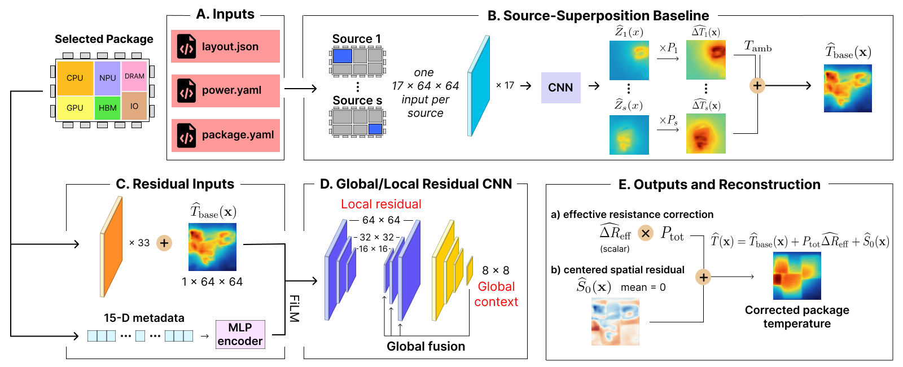

# ChipTherm

ChipTherm is a physics-guided thermal surrogate for prediction across chiplet package families. The project focuses on a distinction that is often hidden by aggregate surrogate results: **seen-family interpolation**, where new power workloads are evaluated on package families represented during training, versus **unseen-family generalization**, where the package structure itself was absent from training.

Learned thermal models can be accurate in the first setting yet degrade under package-level distribution shift. ChipTherm evaluates both regimes explicitly and uses a source-decomposed architecture to predict steady-state, full-package 2D temperature fields for repeated screening before detailed thermal verification.

## Pipeline

ChipTherm uses a two-stage physics-guided decomposition.

1. **Source-superposition baseline.** For each active chiplet, a shared source-response CNN processes a 17-channel, 64 × 64 full-package representation conditioned on that source. It predicts an effective unit-power source-to-grid response, which is multiplied by the chiplet power. The power-scaled responses are summed with ambient temperature:

$$
T_{\mathrm{base}}(x) = T_{\mathrm{amb}} + \sum_s P_s Z_s(x).
$$

This preserves source-wise power scaling and additive thermal contributions instead of requiring one network to infer the complete field directly.

2. **Package residual correction.** A global/local multiscale residual CNN combines the source-superposition field with package context and physical metadata. It predicts a scalar effective-resistance correction for the package-wide temperature shift and an explicitly zero-mean spatial residual for localized interactions:

$$
T(x) = T_{\mathrm{base}}(x) + P_{\mathrm{total}}\Delta R_{\mathrm{eff}} + S_0(x),
\qquad \langle S_0 \rangle = 0.
$$

## Dataset and Evaluation

The current **ChipTherm Benchmark** contains **10,000 HotSpot-generated temperature maps** from **50 structurally distinct package families**, with **200 power workloads per family**. Packages contain 6-64 chiplets and span approximately 1088-4480 mm². Families vary in chiplet count, geometry, composition, occupancy, and placement. All use a common material stack and cooling boundary condition so the study isolates structural and workload variation rather than material or cooling generalization.

The protocol assigns 40 families to training, 5 unseen families to validation and model selection, and 5 separate unseen families to final testing. A separate workload split within the 40 training families measures seen-family interpolation.

## Results

Full-map errors are measured against HotSpot-generated reference temperatures under identical seen- and unseen-family protocols.

| Model | Seen MAE | Seen RMSE | Unseen MAE | Unseen RMSE |
|---|---:|---:|---:|---:|
| FNO | 0.375 K | 0.581 K | 1.494 K | 2.447 K |
| U-FNO | 0.338 K | 0.561 K | 1.754 K | 2.821 K |
| SAU-FNO | 0.528 K | 0.754 K | 1.545 K | **2.398 K** |
| **ChipTherm** | **0.150 K** | **0.284 K** | **1.331 K** | 2.486 K |

ChipTherm has the lowest full-map MAE in both regimes. Its unseen-family MAE improves by **10.9% over FNO** (1.494 K to 1.331 K), while its seen-family MAE is **55.6% lower than U-FNO** (0.338 K to 0.150 K). SAU-FNO retains the best unseen-family RMSE, and the remaining gap between seen- and unseen-family errors shows that cross-family generalization remains difficult.

### Pipeline Ablation

| Configuration | Seen MAE | Unseen MAE |
|---|---:|---:|
| Direct CNN | 0.370 K | 1.767 K |
| Source-superposition baseline | 1.388 K | 1.668 K |
| **Full ChipTherm** | **0.150 K** | **1.331 K** |

Source superposition alone improves unseen-family MAE over direct CNN prediction, while the residual correction is necessary for strong final accuracy. The two stages are complementary: one supplies a structured initial estimate, and the other recovers package-wide offsets and localized interactions.

## Efficiency

The complete two-stage ChipTherm model contains **2.664M parameters**, approximately 34% fewer than U-FNO and SAU-FNO. Uncached inference takes **23.45 ms/package** on an **NVIDIA RTX A6000**, corresponding to a **210.8x speedup** over the recorded HotSpot runtime in the reference setup.

## Status

ChipTherm is an active research project; training and evaluation scripts, expanded benchmarks, figures, and documentation are still being consolidated.