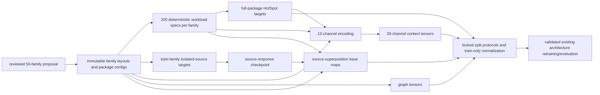

# Benchmark v2 Dependency Graph

## Current 20-family DAG

```mermaid
flowchart TD
  A[case01-case10 example templates] --> B[training_set_1k raw runs]
  A --> C[training_set_4k_extra raw runs]
  H[HotSpot executable and hotspot_base.config] --> B
  H --> C
  B --> D[legacy encoded X and Y]
  C --> D
  B --> E[physics-v1 predictions and residuals]
  C --> E
  D --> F[dataset_v1 combined index]
  E --> F
  F --> G[package_plus_power context X]
  G --> I[dataset_v2_clean deduplicated split]
  I --> J[finite-source 17-channel X]
  J --> K[impedance 33-channel X]
  K --> L[metadata table]
  K --> M[case01-case10 graph tensors]

  N[benchmark_extension_v1 cases.yaml] --> O[case11-case20 raw full runs]
  H --> O
  O --> P[extension encoded 13-channel X and Y]
  P --> Q[extension finite-source 17-channel X]
  Q --> R[extension impedance 33-channel X]
  R --> S[extension metadata table]
  R --> T[extension graph tensors]

  I --> U[300 selected package rows]
  B --> U
  C --> U
  U --> V[6960 isolated-source HotSpot targets]
  H --> V
  V --> W[source-response checkpoint and train-only normalization]

  K --> X[case01-case10 learned source-superposition maps]
  M --> X
  B --> X
  C --> X
  W --> X
  R --> Y[case11-case20 learned source-superposition maps]
  T --> Y
  O --> Y
  W --> Y

  X --> Z[merged 20-family sample and family split indices]
  Y --> Z
  L --> Z
  S --> Z
  M --> Z
  T --> Z

  Z --> AA[train-only raster, base, metadata, graph, and delta-R statistics]
  AA --> AB[feature-fusion residual CNN and optional GNN checkpoints]
  Z --> AB
  AB --> AC[evaluation, integrated runtime, and spatial audit]
  Z --> AC
  W --> AC
```

The graph has two non-obvious edges. First, the source-response dataset loads
source geometry and power lazily from the raw legacy package trees; isolated
target arrays alone are insufficient. Second, source-superposition maps are
checkpoint-derived and therefore inherit the source checkpoint's train split,
normalization, source enumeration order, and code version.

## Plain-text dependency table

| Node | Artifact | Produced by | Direct parents | Required by |
|---|---|---|---|---|
| A | `examples/benchmarks/case01-case10` | `create_benchmark_cases.py` or retained templates | design inputs | legacy raw generation |
| B/C | `training_set_1k`, `training_set_4k_extra` | `generate_benchmark_dataset.py` | A, HotSpot | encoded Y, physics-v1, clean split lineage, source-response inputs |
| D | per-source `encoded` X/Y | `encode_dataset.py` | B/C | combined logical dataset |
| E | physics-v1 predictions/residuals | `evaluate_physics_baseline.py` | D and physics baseline | old residual models and canonical compatibility columns |
| F | `dataset_v1` | `build_combined_dataset.py` | D/E | context datasets |
| G | package-plus-power context | `build_context_dataset.py` | F | clean split parent |
| I | `dataset_v2_clean` | `build_clean_deduplicated_splits.py` | G | all clean case01-case10 descendants |
| J | finite-source X | `build_finite_source_feature_dataset.py` | I, raw layout/power/package | impedance X |
| K | impedance 33-channel X | `build_thermal_impedance_feature_dataset.py` | J, raw layout/power/package | current CNN input and metadata/graph views |
| L | metadata table | `build_metadata_features.py` | K, raw source files | FiLM metadata conditioning |
| M | graph tensors | `build_graph_features.py` | K, raw layout/power | graph models and chiplet metrics |
| N | extension config | manually reviewed `cases.yaml` | benchmark design | extension generator |
| O | extension raw full | `build_chiptherm_extension.py` | N, HotSpot | all extension artifacts |
| P | extension encoded 13-channel X/Y | `build_chiptherm_extension_artifacts.py` and `encode_dataset.py` | O | extension context |
| Q/R | extension finite/impedance X | `build_extension_context_features.py` delegates to existing feature builders | P/O | current extension CNN input |
| S/T | extension metadata/graphs | metadata and graph builders | R/O | conditioned CNN/GNN |
| V | isolated-source targets | `build_source_response_dataset.py` and diagnostic HotSpot runner | selected B/C rows, HotSpot | source-response training |
| W | source-response checkpoint | `train_source_response_model.py` | V, selected source files | every learned source base and integrated inference |
| X/Y | source-superposition maps and residuals | `build_full_source_superposition_base.py` | W, 33-channel or >=8-channel X, raw geometry/power | cached residual training/evaluation |
| Z | merged 20-family split views | extension split and merge scripts | X/Y, K/R, L/S, M/T | current benchmark protocols |
| AA | normalization and delta-R statistics | `train_residual_cnn.py` | train partition of Z | checkpoint reconstruction |
| AB | residual checkpoints | `train_residual_cnn.py` | Z/AA | evaluation and integrated inference |
| AC | metrics/audits | evaluation and analysis scripts | AB/Z and W for uncached runtime | publication evidence |

## Regeneration boundaries

- Graphs, metadata, finite-source channels, impedance channels, and learned
  source-base maps are deterministic caches if all exact parents and code
  versions remain available.
- Full HotSpot labels and isolated-source targets are expensive generated
  artifacts. They are theoretically regenerable, but exact reproduction is
  currently blocked by missing executable/container hashes.
- A checkpoint can be evaluated from its embedded normalization, but it cannot
  be scientifically reproduced without the exact train split and parent data.
- A validation report is evidence about an artifact at one time and location;
  it is not a substitute for validating the relocated artifact.

## Proposed v2 DAG

For a fixed family layout, isolated-source HotSpot responses need not be
repeated for all 200 workloads when leakage is disabled and HotSpot remains
linear. One per chiplet per eligible training family is sufficient for
source-response supervision; test-family isolated responses are diagnostic
labels and must not enter training.

